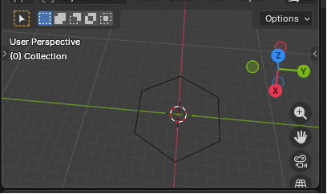

<h1 align="center">Practica: Dibujo de un Poligono en Blender con Python</h1>

<p align="center">
Creacion de un poligono 2D utilizando scripting en Blender
</p>

---

## Descripcion

Esta practica muestra como generar un poligono regular dentro de Blender usando Python.

El script permite:

- Crear una malla nueva  
- Generar vertices mediante trigonometria  
- Conectar los puntos automaticamente  
- Formar un poligono 2D  

---

## Resultado

<p align="center">

</p>

---

## Requisitos

- Blender 5.0 o superior
- Editor de scripting activado

---

## Procedimiento

### 1. Abrir Blender

Ir al modulo:

Scripting

---

### 2. Crear nuevo script

---

### 3. Copiar el codigo

```python
import bpy
import math

def crear_poligono_2d(nombre, lados, radio):

    malla = bpy.data.meshes.new(nombre)
    objeto = bpy.data.objects.new(nombre, malla)
    bpy.context.collection.objects.link(objeto)

    vertices = []
    aristas = []

    for i in range(lados):
        angulo = 2 * math.pi * i / lados
        x = radio * math.cos(angulo)
        y = radio * math.sin(angulo)
        vertices.append((x, y, 0))

    for i in range(lados):
        aristas.append((i, (i+1)%lados))

    malla.from_pydata(vertices, aristas, [])
    malla.update()

bpy.ops.object.select_all(action='SELECT')
bpy.ops.object.delete()

crear_poligono_2d("Poligono2D", lados=6, radio=5)
